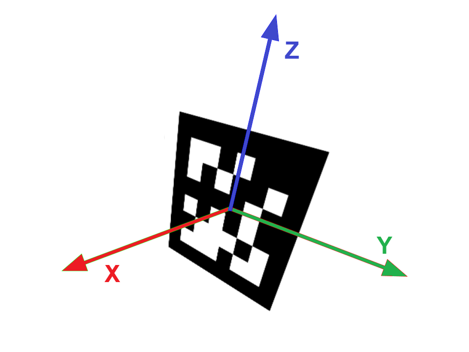

Coordiante Systems
==================

Field and Robot Coordiante Frame
--------------------------------

PhotonVision follows the WPILib conventions for the robot and field coordinate-systems, as defined `here <https://docs.wpilib.org/en/stable/docs/software/advanced-controls/geometry/coordinate-systems.html>`_.

You define the camera to robot transform in the robot coordinate frame.

Camera Coordinate Frame
-----------------------

The camera coordinate system is defined as follows, relative to the camera sensor itself, and when looking in the same direction as the sensor points:

* The origin is the center.
* The x-axis points to the left
* The y-axis points up.
* The z-axis points out.

AprilTag Coordinate Frame
-------------------------

The AprilTag coordinate system is defined as follows, relative to the center of the AprilTag itself:

* The origin is the center.
* The x-axis points to your right
* The y-axis points upwards.

