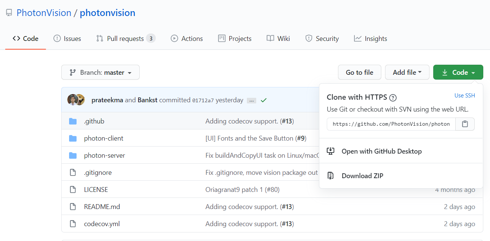

Build Instructions
==================

This section contains the build instructions from the source code available at `our GitHub page <https://github.com/PhotonVision/photonvision>`_.

Development Setup
-----------------

Prerequisites
~~~~~~~~~~~~~

| **Java Development Kit:** This project requires Java Development Kit (JDK) 11 to be compiled. This is the same Java version that comes with WPILib. If you don't have this JDK with WPILib, you can follow the instructions to install JDK 11 for your platform `here <https://bell-sw.com/pages/liberica_install_guide-11.0.7//>`_.
| **Node JS:** The UI is written in Node JS. To compile the UI, Node 10 or newer is required. To install Node JS follow the instructions for your platform `on the official Node JS website <https://nodejs.org/en/download/>`_.

Compiling Instructions
----------------------

Getting the Source Code
~~~~~~~~~~~~~~~~~~~~~~~
Get the source code from git:

.. code-block:: bash

   git clone https://github.com/PhotonVision/photonvision

or alternatively download to source code from github and extract the zip:

Install Necessary Node JS Dependencies
~~~~~~~~~~~~~~~~~~~~~~~~~~~~~~~~~~~~~~

In the photon-client directory:

.. code-block:: bash

   npm install

Build and Copy UI to Java Source
~~~~~~~~~~~~~~~~~~~~~~~~~~~~~~~~

In the photon-server directory:

.. tabs::

   .. group-tab:: Linux

      ``./gradlew buildAndCopyUI``

   .. group-tab:: macOS

      ``./gradlew buildAndCopyUI``

   .. group-tab:: Windows (cmd)

      ``gradlew buildAndCopyUI``

Build and Run the Source
~~~~~~~~~~~~~~~~~~~~~~~~

To compile and run the project, issue the following command in the photon-server directory:

.. tabs::

   .. group-tab:: Linux

      ``./gradlew run``

   .. group-tab:: macOS

      ``./gradlew run``

   .. group-tab:: Windows (cmd)

      ``gradlew run``

Running the following command under the photon-server directory will build the jar under photon-server/build/libs:

.. tabs::

   .. group-tab:: Linux

      ``./gradlew shadowJar``

   .. group-tab:: macOS

      ``./gradlew shadowJar``

   .. group-tab:: Windows (cmd)

      ``gradlew shadowJar``
