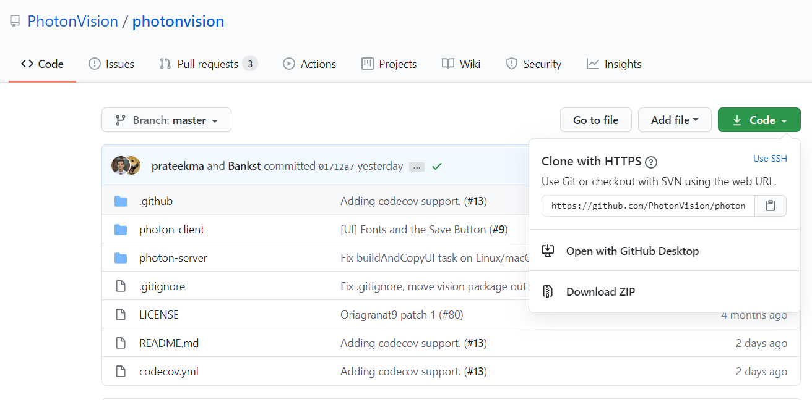

Build Instructions
==================

This section contains the build instructions from the source code available at `our Github page <https://github.com/PhotonVision/photonvision>`_.

Development Setup
-----------------

Prerequisites
~~~~~~~~~~~~~

..
   I am not sure if we support more than 12

| **Java Development Kit:** This project requires Java Development Kit (JDK) 12 to be compiled. You can follow the instructions to install JDK 12 for your platform `here <https://bell-sw.com/pages/liberica_install_guide-12.0.2/>`_.
| **Node JS:** The UI is written in Node JS. To compile the UI, Node 10 or newer is required. To install Node JS follow the instructions for your platform `the official Node JS website <https://nodejs.org/en/download/>`_.

Compiling Instructions
----------------------

Getting the Source Code
~~~~~~~~~~~~~~~~~~~~~~~
Get the source code from git:

.. code-block:: bash

   git clone https://github.com/PhotonVision/photonvision

or alternatively download to source code from github and extract the zip:

Install Necessary Node JS Dependencies
~~~~~~~~~~~~~~~~~~~~~~~~~~~~~~~~~~~~~~

In the photonvision-client directory (${PROJECT_DIR}/photon-client):

.. code-block:: bash

   npm install

Build and Copy UI to Java Source
~~~~~~~~~~~~~~~~~~~~~~~~~~~~~~~~

In the photonvision-server directory (${PROJECT_DIR}/photon-server):

.. code-block:: bash

      gradlew buildAndCopyUI

Build and Run the Source
~~~~~~~~~~~~~~~~~~~~~~~~

In the photonvision-server directory (${PROJECT_DIR}/photon-server):

.. code-block:: bash

      gradlew run

Running the following command under the photonvision-server directory (${PROJECT_DIR}/photon-server) will build the jar under ${PROJECT_DIR}/photon-server/build/libs:

.. code-block:: bash
   
      gradlew shadowJar 
