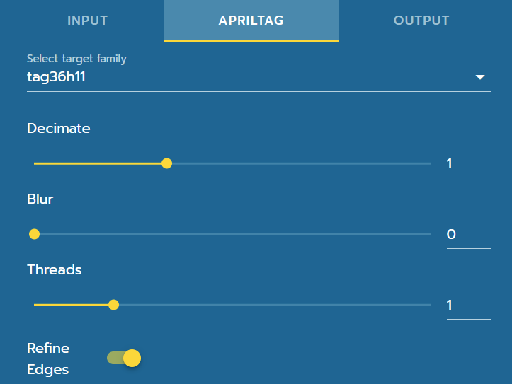

Pipeline Tuning
===============

|

|

Target Family
-------------
Target families are defined by two numbers (before and after the h). The first number is the number of bits the tag is able to encode (which means more tags are available in the respective family) and the second is the hamming distance. Hamming distance describes the ability for error correction while identifying tag ids. A high hamming distance generally means that it will be easier for a tag to be identified even if there are errors. However, as hamming distance increases, the number of available tags decreases. At this time, PhotonVision only offers 36h11 tags, which can either be found here `here <https://github.com/AprilRobotics/apriltag-imgs/tree/master/tag36h11>`_. or in the field guide (linked on previous page).

Decimate
--------

Generally, increasing decimate will decrease reduce the sampling rate within the image. This will lead to increased detection time while decreasing detection distance. 

Blur
----
This controls the sigma of Gaussian blur for tag detection. In clearer terms, increasing blur will make the image blurrier, decreasing it will make it closer to the original image. We strongly recommend that you keep blur to a minimum (0) due to it's high performance intensity unless you have an extremely noisy image.

Threads
-------

Threads refers to the threads within your coprocessor's CPU. The theoretical maximum is device dependent, but we recommend that users to stick to 2 threads. Increasing threads will increase performance at the cost of increased CPU load, temperature increase, etc.

Refine Edges
------------
The edges of the each polygon are adjusted to "snap to" high color differences surrounding it. It is recommended to use this in tandem with decimate as it can increase the quality of the initial estimate.
