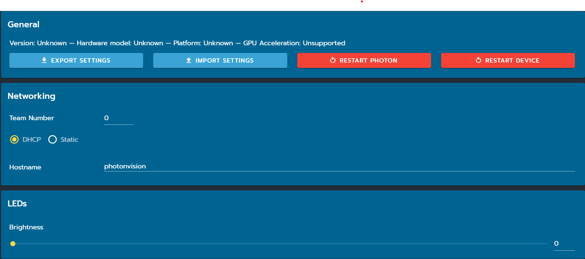

Settings
========

General
^^^^^^^
Here, you can view general data on your system, including version, hardware, your platform, and performace statistics. You can also export/import the settings in a .zip file or restart PhotonVision/your coprocessor.

Networking
^^^^^^^^^^
Here, you can set your team number (note: you must always do this if using PhotonVision on a robot), switch your IP between DCHP and static, and specify your host name. For instructions on how to properly set your static IP, please follow the steps `here <https://docs.photonvision.org/en/latest/docs/getting-started/installation/coprocessor-image.html?highlight=IP#troubleshooting>`_ and then fill in the proper field after you select static IP. For more information on networking, click `here. <https://docs.wpilib.org/en/latest/docs/networking/networking-introduction/networking-basics.html>`_

LEDs
^^^^
If your hardware supports this, here you can adjust the brightness of your LEDs.

