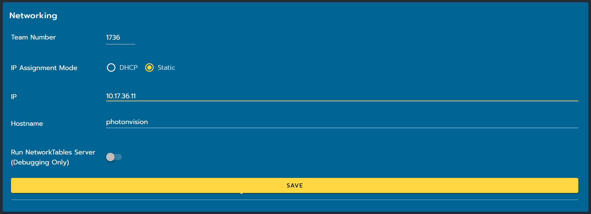

Networking
==========

Physical Networking
-------------------
.. note:: When using PhotonVision off robot, try to plug the coprocessor into a physical router if you can. Windows and other OS are known to be buggy networking wise when a coprocessor is directly plugged in.

PhotonVision *STRONGLY* recommends the usage of a network switch on your robot. This is because the second radio port on the current FRC radios is known to be buggy and cause frequent connection issues that are detrimental during competition. More information can be found in this `ChiefDelphi thread <https://www.chiefdelphi.com/t/why-you-probably-shouldnt-use-the-second-port-on-your-openmesh-om5p-radio-and-embrace-using-an-ethernet-switch-instead/406374>`_ and an in-depth guide on how to install a network switch can be found `on FRC 900's website <https://team900.org/blog/ZebraSwitch/>`_.

Digital Networking
------------------
PhotonVision *STRONGLY* recommends the usage of Static IPs as it increases reliability on the field and when using PhotonVision in general. To properly set up your static IP, follow the steps below:

1. Ensure your robot is on and you are connected to the robot network.
2. Navigate to ``photonvision.local:5800`` (this may be different if you are using a Gloworm / Limelight) in your browser.
3. Open the settings tab on the left pane.
4. Under the Networking section, set your team number.
5. Change your IP to Static.
6. Set your coprocessor's IP address to “10.TE.AM.11”. More information on IP format can be found `here <https://docs.wpilib.org/en/stable/docs/networking/networking-introduction/ip-configurations.html#on-the-field-static-configuration>`_.

7. Click the “Save” button.
8. Set your roboRIO to the following static IP address: “10.TE.AM.2”. This can be done via the `roboRIO web dashboard <https://docs.wpilib.org/en/stable/docs/software/roborio-info/roborio-web-dashboard.html#roborio-web-dashboard>`_.

Power-cycle your robot and then you will now be access the PhotonVision dashboard at ``10.TE.AM.11:5800``.

Port Forwarding
---------------

If you would like to access your Ethernet-connected vision device from a computer when tethered to the USB port on the roboRIO, you can use `WPILib's <https://docs.wpilib.org/en/stable/docs/networking/networking-utilities/portforwarding.html>`_ ``PortForwarder``.

.. tab-set-code::

    .. code-block:: java

        PortForwarder.add(5800, "photonvision.local", 5800);

    .. code-block:: C++

        wpi::PortForwarder::GetInstance().Add(5800, "photonvision.local", 5800);

.. note:: The address in the code above (``photonvision.local``) is the hostname of the coprocessor. This can be different depending on your hardware (ex. for the Gloworm it will be ``gloworm.local``)

Camera Stream Ports
-------------------

The camera streams start at they begin at 1181 with two ports for each camera (ex. 1181 and 1182 for camera one, 1183 and 1184 for camera two, etc.). The easiest way to identify the port of the camera that you want is by double clicking on the stream, which opens it in a seperate page. The port will be listed below the stream.
