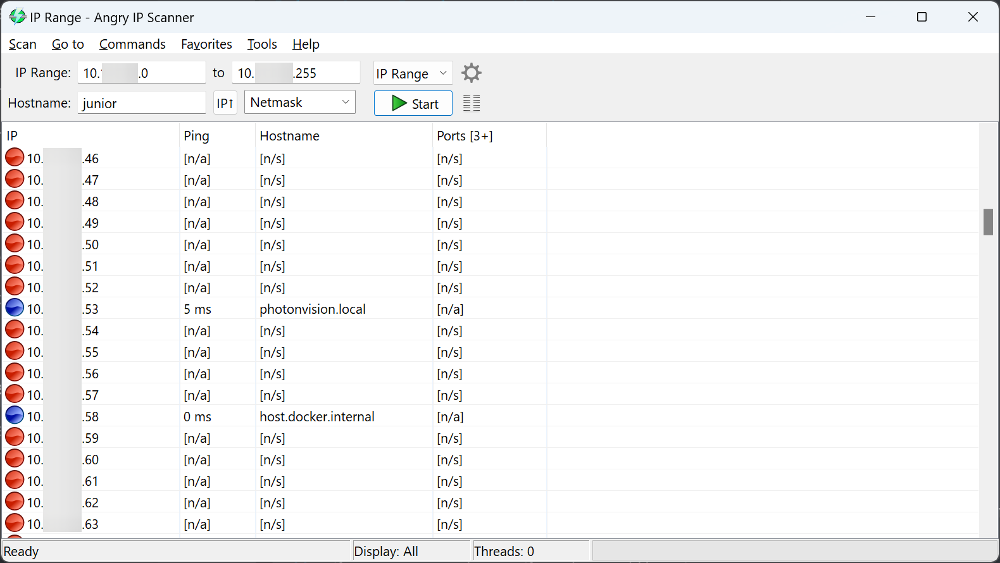

Raspberry Pi Installation
=========================
A Pre-Built Raspberry Pi image is available for ease of installation.

Downloading the Pi Image
------------------------
Download the latest release of the PhotonVision Pi image from the `releases page <https://github.com/PhotonVision/photonvision/releases>`_. You do not need to extract the downloaded ZIP file.

Flashing the Pi Image
---------------------
An 8GB or larger card is recommended.

Use `Balena Etcher <https://www.balena.io/etcher/>`_ to flash an image onto a Raspberry Pi. Select the downloaded ``.zip`` file, select your microSD card, and flash.

For more detailed instructions on using Etcher, please see the `Etcher website <https://www.balena.io/etcher/>`_.

Final Steps
-----------
Insert the flashed microSD card into your Raspberry Pi and boot it up. The first boot may take a few minutes as the Pi expands the filesystem. Be sure not to unplug during this process.

After the initial setup process, your Raspberry Pi should be configured for PhotonVision. You can verify this by making sure your Raspberry Pi and computer are connected to the same network and navigating to ``http://photonvision.local:5800`` in your browser on your computer.

Troubleshooting/Setting a Static IP
-----------------------------------
A static IP address may be used as an alternative to the mDNS ``photonvision.local`` address.

Download and run `Angry IP Scanner <https://angryip.org/download/#windows>`_ to find PhotonVision/your coprocessor on your network.

Once you find it, set the IP to a desired :ref:`static IP in PhotonVision. <docs/hardware/Settings:Networking>`

Updating PhotonVision
---------------------

Download the latest stable Raspberry Pi .jar (appended with -raspi at the end) from `our releases page <https://github.com/PhotonVision/photonvision/releases>`_, go to the settings tab, and upload the .jar using the Offline Update button.

As an alternative option - Export your settings, reimage your coprocessor using the instructions above, and import your settings back in.
