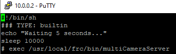

Installing PhotonVision on a Romi
=================================

The Romi is a small robot that can be controlled with the WPILib software.  The main controller is a Raspberry Pi that must be imaged with `WPILibPi <https://docs.wpilib.org/en/latest/docs/romi-robot/imaging-romi.html>`_ .

Installation
------------

SSH into the Raspberry Pi (using a tool like `Putty <https://www.putty.org/>`_ ) at the Romi's default address ``10.0.0.2``.  The default user is ``pi``, and the password is ``raspberry``. 

Follow the process for installing PhotonVision on :ref:`"Other Debian-Based Co-Processor Installation" <docs/getting-started/installation/coprocessor-image:Other Debian-Based Co-Processor Installation>`.  As it mentions this will require an internet connection so plugging into the ethernet jack on the Raspberry Pi will be the easiest solution.

The WPILibPi image includes FRCVision which reserves USB cameras by default so we need to edit the /home/pi/runCamera script to disable it.  First we will need to make the file system writeable, the easiest way to do this is to go to ``10.0.0.2`` and choose "Writable" at the top.  

Next from the SSH terminal run ``sudo vi /home/pi/runCamera`` then arrow down to the echo line and press "o" to add a new line.  Then type ``sleep 10000`` and press "Esc".  Arrow down to the beginning of the exec line and press "i" (to insert) and then add ``#`` before the exec command to comment it out.  Lastly hit "Esc" and then type ":wq" to save the file.  Now reboot the Romi by typing ``sudo reboot``.

After it comes back up you should be able to `locate the PhotonVision UI <https://gloworm.vision/docs/quickstart/#finding-gloworm>`_ at: ``http://10.0.0.2:5800/``.
