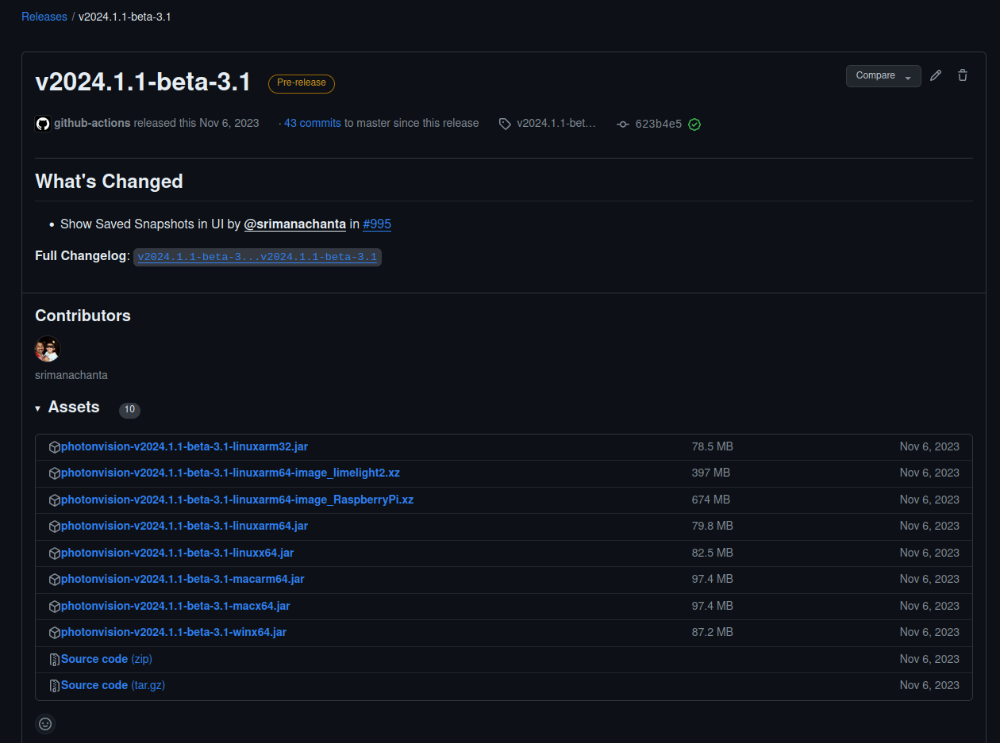

Updating PhotonVision
=====================

PhotonVision provides many different files on a single release page. Each release contains JAR files for performing "offline updates" of a device with PhotonVision already installed, as well as full image files to "flash" to supported coprocessors.

In the example release above, we see:

- Image files for flashing directly to supported coprocessors.

  - Raspberry Pi 3/4/5/CM4: follow our :ref:`Raspberry Pi flashing instructions<docs/getting-started/installation/sw_install/raspberry-pi:Raspberry Pi Installation>`.
  - For LimeLight devices: follow our :ref:`LimeLight flashing instructions<docs/getting-started/installation/sw_install/limelight:Imaging>`.
  - For Orange Pi 5 devices: follow our :ref:`Orange Pi flashing instructions<docs/getting-started/installation/sw_install/orange-pi:Orange Pi Installation>`.

- JAR files for the suite of supported operating systems for use with Offline Update. In general:

  - Raspberry Pi, Limelight, and Orange Pi: use images suffixed with -linuxarm64.jar. For example: :code:`photonvision-v2024.1.1-linuxarm64.jar`
  - Beelink and other Intel/AMD-based Mini-PCs: use images suffixed with -linuxx64.jar. For example: :code:`photonvision-v2024.1.1-linuxx64.jar`

Offline Update
--------------

Unless noted in the release page, an offline update allows you to quickly upgrade the version of PhotonVision running on a coprocessor with PhotonVision already installed on it.

Unless otherwise noted on the release page, config files should be backward compatible with previous version of PhotonVision, and this offline update process should preserve any pipelines and calibrations previously performed. For paranoia, we suggest exporting settings from the Settings tab prior to performing an offline update.

.. note:: Carefully review release notes to ensure that reflashing the device (for supported devices) or other installation steps are not required, as dependencies needed for PhotonVision may change between releases
