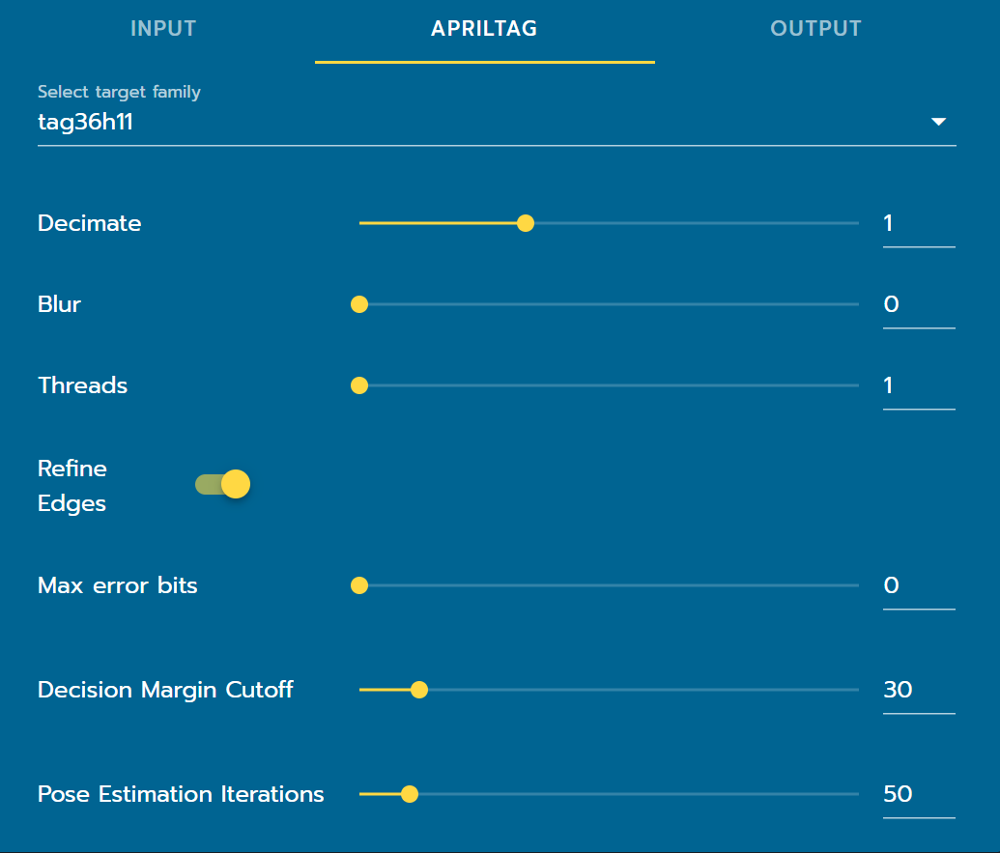

AprilTag Tuning
===============

|

Target Family
-------------
Target families are defined by two numbers (before and after the h). The first number is the number of bits the tag is able to encode (which means more tags are available in the respective family) and the second is the hamming distance. Hamming distance describes the ability for error correction while identifying tag ids. A high hamming distance generally means that it will be easier for a tag to be identified even if there are errors. However, as hamming distance increases, the number of available tags decreases. The 2023 FRC game will be using 16h5 tags, which can be found `here <https://github.com/AprilRobotics/apriltag-imgs/tree/master/tag16h5>`_. PhotonVision also supports the usage of 36h11 tags.

Decimate
--------

Decimation (also known as down-sampling) is the process of reducing the sampling frequency of a signal (in our case, the image). Increasing decimate will lead to an increased detection rate while decreasing detection distance. We recommend keeping this at the default value.

Blur
----
This controls the sigma of Gaussian blur for tag detection. In clearer terms, increasing blur will make the image blurrier, decreasing it will make it closer to the original image. We strongly recommend that you keep blur to a minimum (0) due to it's high performance intensity unless you have an extremely noisy image.

Threads
-------

Threads refers to the threads within your coprocessor's CPU. The theoretical maximum is device dependent, but we recommend that users to stick to one less than the amount of CPU threads that your coprocessor has. Increasing threads will increase performance at the cost of increased CPU load, temperature increase, etc. It may take some experimentation to find the most optimal value for your system.

Refine Edges
------------
The edges of the each polygon are adjusted to "snap to" high color differences surrounding it. It is recommended to use this in tandem with decimate as it can increase the quality of the initial estimate.

Pose Iterations
---------------
Pose iterations represents the amount of iterations done in order for the AprilTag algorithm to converge on its pose solution(s). A smaller number between 0-100 is recommended. A smaller amount of iterations cause a more noisy set of poses when looking at the tag straight on, while higher values much more consistently stick to a (potentially wrong) pair of poses. WPILib contains many useful filter classes in order to account for a noisy tag reading. 

Max Error Bits
--------------
Max error bits, also known as hamming distance, is the number of positions at which corresponding pieces of data / tag are different. Put more generally, this is the number of bits (think of these as squares in the tag) that need to be changed / corrected in the tag to correctly detect it. A higher value means that more tags will be detected while a lower value cuts out tags that could be "questionable" in terms of detection.

We recommend a value of 0 for the 16h5 and 7+ for the 36h11 family.

Decision Margin Cutoff
-----------------------
The decision margin cutoff is how much “margin” the detector has left before it rejects a tag; increasing this rejects poorer tags. We recommend you keep this value around a 30. 
