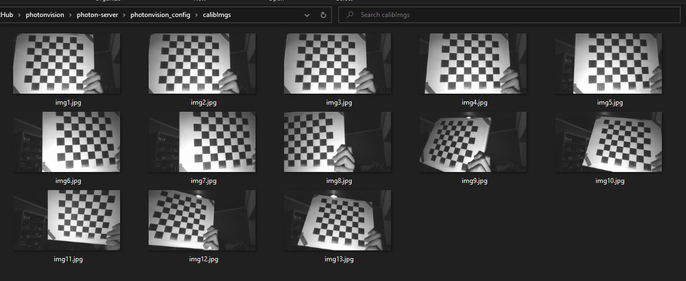

Calibrating Your Camera
=======================

.. important:: In order to detect AprilTags and use 3D mode, your camera must be calibrated at the desired resolution! Inaccurate calibration will lead to poor performance.

To calibrate a camera, images of a chessboard (or grid of dots) are taken. by comparing where the grid corners (or dots) should be in object space (for example, a dot once every inch in an 8x6 grid) with where they appear in the camera image, we can find a least-squares estimate for intrinsic camera properties like focal lengths, center point, and distortion coefficients. For more on camera calibration, please review the `OpenCV documentation <https://docs.opencv.org/4.x/dc/dbb/tutorial_py_calibration.html>`_.

.. warning:: While any resolution can be calibrated, resolutions lower than 960x720 are often too low to provide accurate results. Additionally, high resolutions may be too performance intensive for a coprocessor like a Raspberry Pi to handle (solutions to this are being looked into). Thus, we recommend 960x720 when using 3D mode.

.. note::The calibration data collected during calibration is specific to each physical camera, as well as each individual resolution.

Calibration Tips
----------------
Accurate camera calibration is required in order to get accurate pose measurements when using AprilTags and 3D mode. The tips below should help ensure success:

1. Practice calibration using your laptop webcam and https://www.calibdb.net/. The target can be found on the website and should be printed out if possible. Once you print it out, try to line up your target with the overlay on the screen as best as possible. The point of this practice is to notice how you are prompted to place targets in certain positions on the screen that make sure you account for all regions of the sensor. Also notice how the target is tilted when taking calibration pictures. When taking calibration pictures for PhotonVision, keep those same principles in mind.

2. Ensure your the images you take have the target in different positions and angles, with as big of a difference between angles as possible. It is important to make sure the target overlay still lines up with the board while doing this. Tilt no more than 45 degrees.

3. Use as big of a calibration target as your printer can print.

4. Ensure that your printed pattern has enough white border around it.

5. Ensure your camera stays in one position during the duration of the calibration.

6. Make sure you get all 12 images from varying distances and angles.

7. Take at least one image that covers the total image area, and generally ensure that you get even coverage of the lens with your image set.

8. Have good lighting, having a diffusely lit target would be best (light specifically shining on the target without shadows).

9. Ensure the calibration target is completely flat and does not bend or fold in any way. It should be mounted/taped down to something flat and then used for calibration, do not just hold it up.

Following the ideas above should help in getting an accurate calibration.

Calibration Steps
-----------------

1. Navigate to the calibration section in the UI.
^^^^^^^^^^^^^^^^^^^^^^^^^^^^^^^^^^^^^^^^^^^^^^^^^
The Cameras tab of the UI houses PhotonVision's camera calibration tooling. It assists users with calibrating their cameras, as well as allows them to view previously calibrated resolutions. We support both dot and chessboard calibrations.

2. Print out the calibration target.
^^^^^^^^^^^^^^^^^^^^^^^^^^^^^^^^^^^^

In the Camera Calibration tab, we'll print out the calibration target using the "Download" button. This should be printed on 8.5x11 printer paper. This page shows using an 8x8 chessboard.

.. warning:: Ensure that there is no scaling applied during printing (it should be at 100%) and that the PDF is printed as is on regular printer paper. Check the square size with calipers or an accurate measuring device after printing to ensure squares are sized properly, and enter the true size of the square in the UI text box. For optimal results, various resources are available online to calibrate your specific printer if needed.

3. Select calibration resolution and fill in appropriate target data.
^^^^^^^^^^^^^^^^^^^^^^^^^^^^^^^^^^^^^^^^^^^^^^^^^^^^^^^^^^^^^^^^^^^^^

We'll next select a resolution to calibrate and populate our pattern spacing and board size. The provided chessboard is 8 squares in width and height, and each square should be about 1in across. Mine measured with a caliper was 0.96in, but this will vary per printer. Finally, once our entered data is correct, we'll click "start calibration."

4. Take at calibration images from various angles.
^^^^^^^^^^^^^^^^^^^^^^^^^^^^^^^^^^^^^^^^^^^^^^^^^^

Now, we'll capture images of our chessboard from various angles. The most important part of this step is to make sure that the chessboard overlay matches the chessboard in your image. The further the overdrawn points are from the true position of the chessboard corners, the less accurate the final calibration will be. We'll want to capture at least 12 images, trying to take one in each region of the camera sensor. Once we've got our images, we'll click "Finish calibration" and wait for the calibration process to complete. If all goes well, the mean error and standard deviation will be shown in the table on the right.

.. raw:: html

        <video width="85%" controls>
            <source src="../../../_static/assets/calibration_small.mp4" type="video/mp4">
            Your browser does not support the video tag.
        </video>

Accessing Calibration Images
----------------------------
For advanced users, these calibrations can be later accessed by :ref:`exporting your config directory <docs/hardware/config:Directory Structure>` and viewing the camera's config.json file. Furthermore, the most recent snapshots will be saved to the calibImgs directory.

