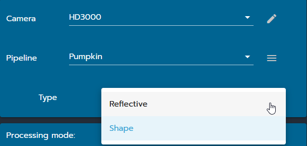
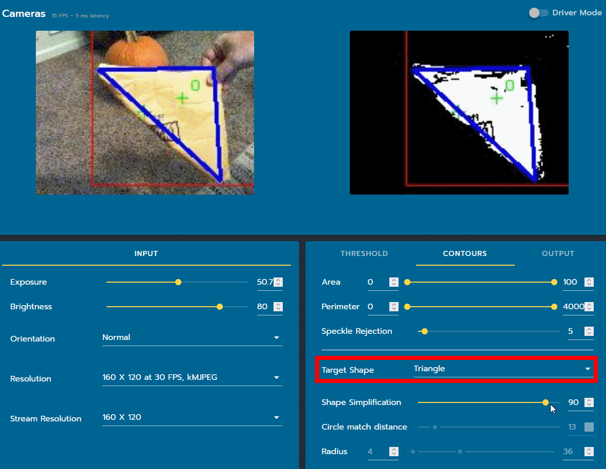
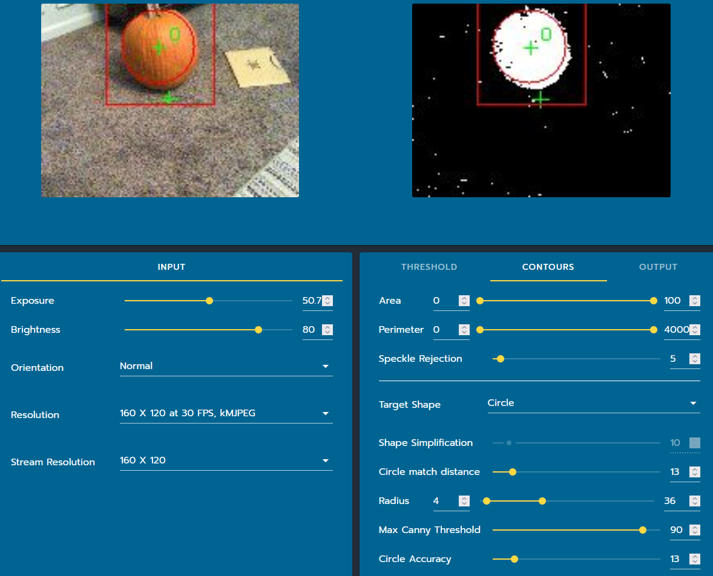

Colored Shape
=============

``Shape`` is a seperate pipeline type that can be selected by using the dropdown in the upper right corner.

Target Shape
------------

The contours tab has new options for specifying the properties of your colored shape.  The target shape types are:

* Circle - No edges
* Triangle - 3 edges
* Quadrilateral - 4 edges
* Polygon - Any number of edges

Shape Settings
--------------

Only the settings used for the current target shape are available.

* Shape Simplification - This is the only setting available for polygon, triangle, and quadrilateral target shapes.  This setting also needs to be fairly high (>75) if you are having any problems getting pefectly clean edges.  This high setting helps prevent imperfections in the edge from being counted as a seperate edge.

* Circle Match Distance - How close the centroid of a contour must be to the center of the circle in order for them to be matched.  This value is usually pretty small (<25) as you usually only want to identify circles that are nearly centered in the contour.

* Radius - Percentage of the frame that the radius of the circle represents.

* Max Canny Threshold - This sets the amount of change between pixels needed to be considered an edge. The smaller it is, the more false circles may be detected. Circles, corresponding to the larger accumulator values, will be returned first.

* Circle Accuracy - This determines how perfect the circle contour must be in order to be considered a circle.  Low values (<40) are required to detect things that aren't perfect circles.

