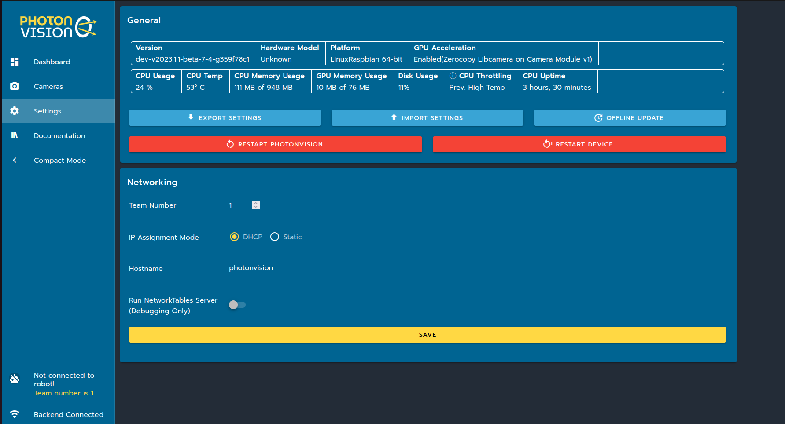

Settings
========

General
^^^^^^^
Here, you can view general data on your system, including version, hardware, your platform, and performance statistics. You can also export/import the settings in a .zip file or restart PhotonVision/your coprocessor.

Networking
^^^^^^^^^^
Here, you can set your team number (note: you must always do this if using PhotonVision on a robot), switch your IP between DCHP and static, and specify your host name. For more information about on-robot networking, click `here. <https://docs.wpilib.org/en/latest/docs/networking/networking-introduction/networking-basics.html>`_

LEDs
^^^^
If your coprocessor electronics support hardware-controlled LED's and has the proper hardware configuration set up, here you can adjust the brightness of your LEDs.

