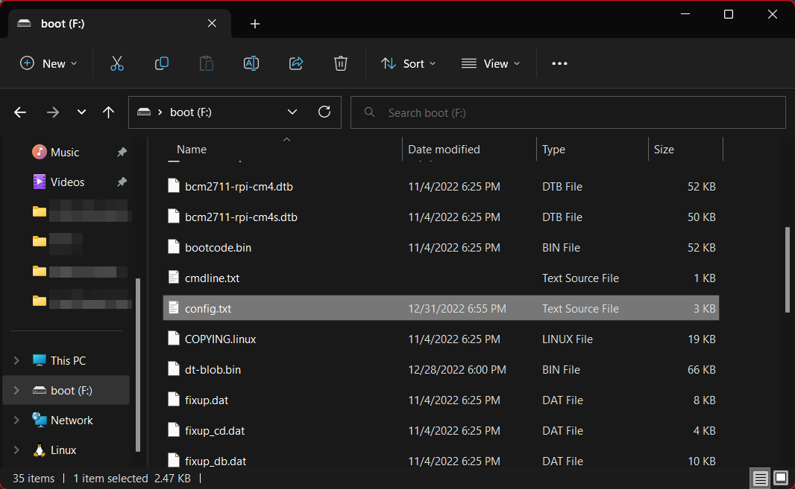

Pi Camera Configuration
=======================

Background
----------

The Raspberry Pi CSI Camera port is routed through and processed by the GPU. Since the GPU boots before the CPU, it must be configured properly for the attached camera. Additionally, this configuration cannot be changed without rebooting.

The GPU is not always capable of detecting other cameras automatically. The file ``/boot/config.txt`` is parsed by the GPU at boot time to determine what camera, if any, is expected to be attached. This file must be updated for some cameras.

.. warning:: Incorrect camera configuration will cause the camera to not be detected. It looks exactly the same as if the camera was unplugged.

Updating ``config.txt``
-----------------------

After flashing the Pi image onto an SD card, open the ``boot`` segment in a file browser.

.. note:: Windows may report "There is a problem with this drive". This should be ignored.

Locate ``config.txt`` in the folder, and open it with your favorite text editor.

Within the file, find this block of text:

.. code-block::

  ##############################################################
  ### PHOTONVISION CAM CONFIG
  ### Comment/Uncomment to change which camera is supported
  ### Picam V1, V2 or HQ: uncomment (remove leading # ) from camera_auto_detect=1,
  ### and comment out all following lines
  ### IMX290/327/OV9281/Any other cameras that require additional overlays:
  ### Comment out (add a # ) to camera_auto_detect=1, and uncomment the line for
  ### the sensor you're trying to user
  ### On devices with multiple CSI cameras like the CM4 and Pi 5 you will need to
  ### declare which port each camera is plugged into (assuming your not using
  ### autodetect). Remove the # before ",cam0" to define if a camera is plugged into
  ### csi0. The config automatically assumes no port definition to be CSI1.

  cameraAutoDetect=1

  # dtoverlay=imx290,clock-frequency=74250000#,cam0
  # dtoverlay=imx290,clock-frequency=37125000#,cam0
  # dtoverlay=imx378#,cam0
  # dtoverlay=ov9281#,cam0

  ##############################################################

Remove the leading ``#`` character to uncomment the line associated with your camera. Add a ``#`` in front of other cameras.

.. warning:: Leave lines outside the PhotonVision Camera Config block untouched. They are necessary for proper raspberry pi functionality.

Save the file, close the editor, and eject the drive. The boot configuration should now be ready for your selected camera.

Additional Information
----------------------

See `the libcamera documentation <https://github.com/raspberrypi/documentation/blob/develop/documentation/asciidoc/computers/camera/rpicam_apps_getting_started.adoc>`_ for more details on configuring cameras.
