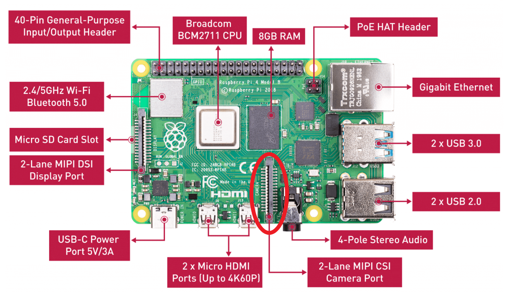
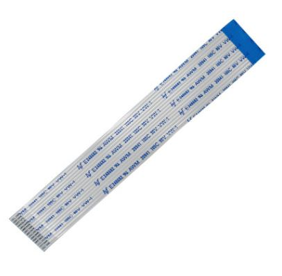
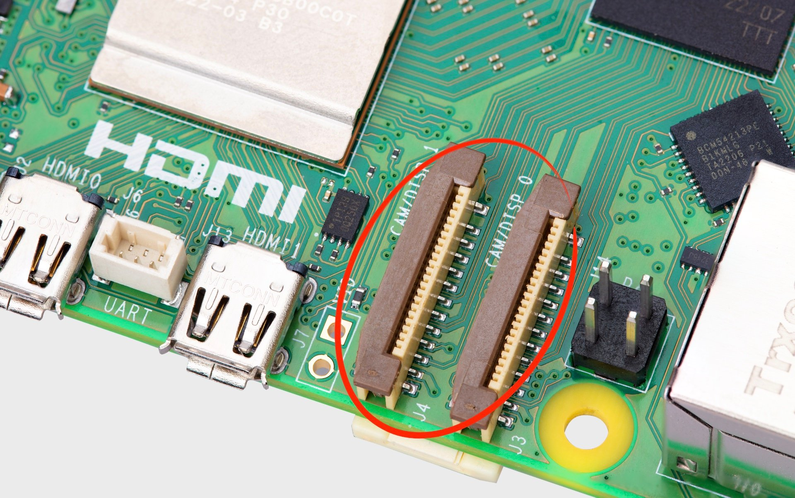
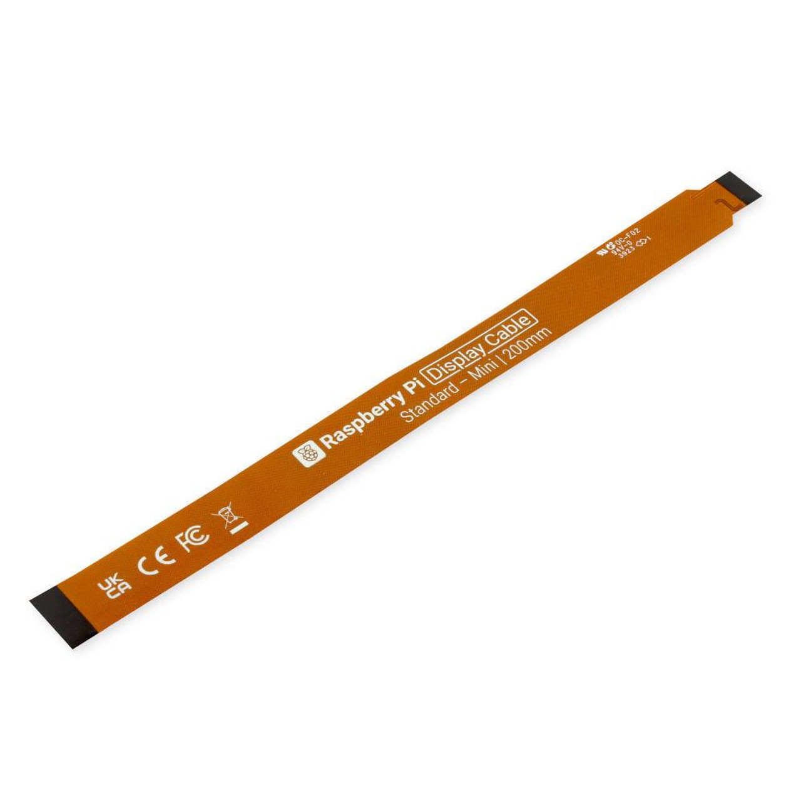

Pi Camera Wiring
================

Background
----------

The Raspberry Pi boards feature dedicated CSI ports (1 on Pi 3 and 4, while Pi 5 and CM4 have two), which is a ribbon cable connector designed for connecting a camera module to the Raspberry Pi. This port allows users to attach a compatible camera and leverage its capabilities for various applications, such as image and video capture, computer vision projects, and more.

.. warning:: Incorrect camera connection may not work or cause damage to the board or camera.
.. warning:: Long ribbon cables are not recommended for use in FRC as they are very fragile and may be susceptible to noise.
.. warning:: Please note which connector your Raspberry Pi has before you purchase one (they have different pin counts).

Pi 3 and 4
----------

The Raspberry Pi 3 and 4 both have a single 15 pin CSI camera port.

Pi 5
----

The Raspberry Pi 5 has two much smaller 22 pin CSI camera port.

