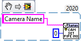

Driver Mode Pipeline Index And LED Mode
=======================================

Set Driver Mode
---------------

Toggle driver mode using PhotonCamera_SetDriverMode.vi

Set Pipeline Index
---------------

The same can be done to change the pipeline index by using PhotonCamera_SetPipelineIndex.vi

Set LED Mode
---------------

And the LED mode with PhotonCamera_SetLEDMode.vi

