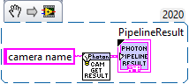
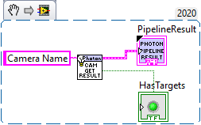
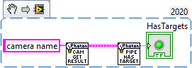
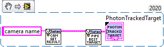
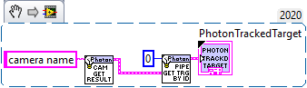
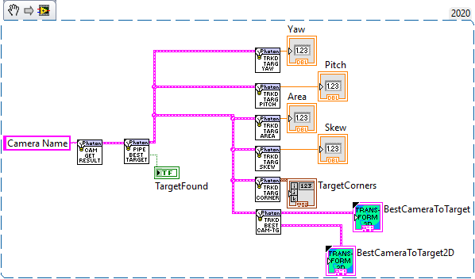

Getting Target Data
===================

Getting The Latest Result
------------------------

What is a Photon Pipeline Result
^^^^^^^^^^^^^^^^^^^^^^^^^^^^^^^^

A ``PhotonPipelineResult`` is a bundle that contains all information about currently detected targets from a camera. You can retrieve the latest pipeline result using ``PhotonCamera_GetLatestResult.vi``

Checking for Existence of Targets
--------------------

``PhotonCamera_GetLatestResult.vi`` will output a boolean named ``hasTargets?`` to inform the user as to whether the result contains any targets.

``PhotonPipelineResult_HasTargets?.vi`` can also be used to check for the existence of targets.

Getting an Array of Targets
---------------------------

What is a Photon Tracked Target?
^^^^^^^^^^^^^^^^^^^^^^^^^^^^^^^^

A tracked target contains information about a target from a pipeline result. This information includes yaw, pitch, area, and robot relative pose.

Each pipeline result contains an array of targets. Use LabVIEW's ``Unbunlde by name`` node to get access to the array of targets.

.. image:: images/get_targets.png

Getting The Best Target
-----------------------

You can get the `best target <https://docs.photonvision.org/en/latest/docs/getting-started/pipeline-tuning/reflectiveAndShape/contour-filtering.html#contour-grouping-and-sorting>`_ using ``PhotonPipelineResult_GetBestTarget.vi`` 

Getting Target By ID
--------------------

If you are using an AprilTag pipeline you can use ``PhotonPipelineResult_GetBestTargetById.vi`` will return a target with a specified ID.

Getting Target Data
-------------------
* double ``PhotonTrackedTarget_GetYaw.vi``: The yaw of the target in degrees (positive right).
* double ``PhotonTrackedTarget_GetPitch.vi``: The pitch of the target in degrees (positive up).
* double ``PhotonTrackedTarget_GetArea.vi``: The area (how much of the camera feed the bounding box takes up) as a percent (0-100).
* double ``PhotonTrackedTarget_GetSkew.vi``: The skew of the target in degrees (counter-clockwise positive).
* double[] ``PhotonTrackedTarget_GetConors.vi``: The 4 corners of the minimum bounding box rectangle.
* Transform2d ``PhotonTrackedTarget_GetBestCameraToTarget.vi``: The camera to target transform. See `2d transform documentation here <https://docs.wpilib.org/en/latest/docs/software/advanced-controls/geometry/transformations.html#transform2d-and-twist2d>`_.

