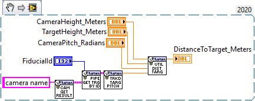

Using Target Data
=================

Calculate Distance to Target
------------------------------

If your camera is at a fixed height on your robot and the height of the target is fixed, you can calculate the distance to the target based on your camera’s pitch and the pitch to the target.

