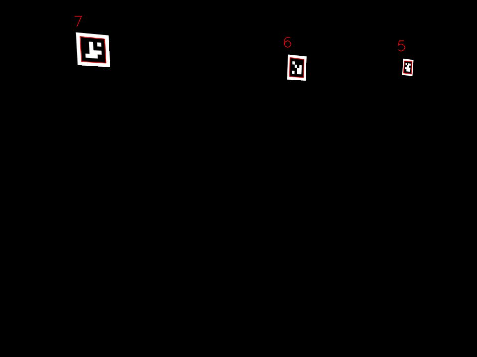

Simulation Support in PhotonLib
===============================

What Is Supported?
------------------

.. warning:: This simulation overhaul currently only supports Java. 

PhotonLib supports simulation of a camera and coprocessor running PhotonVision moving about a field on a robot.

You can use this to help validate your robot code's behavior in simulation without needing a physical robot.

Simulated Vision System
-----------------------

A ``VisionSystemSim`` represents the camera, coprocessor, and PhotonVision software moving around on the field. (Note this is different than the official soon to be deprecated SimVision)

The system takes in a series of simulated targets which must be set to the field layout or a custom tag layout. ``VisionSystemSim`` also holds ``PhotonCameraSim`` which must be configured to match the desired physical camera to simulate distortion and latency. 

While processing, the given robot ``Pose2d`` or ``Pose3d`` is used to analyze which targets should be in view, and determine where they would have shown up in the camera image. 

.. image:: images/SimArchitecture.svg

VisionSystemSim Initialization
------------------------------

First as an example, create a subsystem to hold and call a periodic function to update the simulation.

.. tab-set-code::
   .. code-block:: java

        public class SimPhotonVision extends SubsystemBase{
            public SimVisionSystem() {
            }
            @Override
            public void periodic() {
            }
        }

Create the ``VisionSystemSim``

.. tab-set-code::
   .. code-block:: java

        public class SimPhotonVision extends SubsystemBase{
            VisionSystemSim simVision = new VisionSystemSim("photonvision");

then we would like to setup a ``Transform3d`` to represent the position of the simulated camera

.. tab-set-code::
   .. code-block:: java

        double camPitch = Units.degreesToRadians(10); // radians
        double camHeightOffGround = 0.8; // meters
        Transform3d cameratrans = new Transform3d(
            new Translation3d(0.0, 0, camHeightOffGround), new Rotation3d(0, camPitch, 0));

Then create the real camera object if not already defined in the real robot code. then create the simulated camera object which is linked to the real camera to publish the NT4 readings for it. The ``PhotonCameraSim`` also allows for a json to be loaded to mimick the exact setup of your hardware. this example selects a preset Limelight preset which sets the lens distortion,latency, and other parameters soted in ``SimCameraProperties``. The final two parameters set the percent for tag detection and the max detection range in meters

.. tab-set-code::
   .. code-block:: java

        PhotonCamera realCam;
        PhotonCameraSim simCam;
        public SimPhotonVision() {
            realCam = new PhotonCamera("camera1");
            simCam = new PhotonCameraSim(realCam, SimCameraProperties.LL2_960_720(),0.05,20);

Once the simCam has been created it needs to be added to the instance of ``VisionSystemSim`` passing the simulated camera and the ``Transform3d`` representing its location relative to the robot origin.

.. tab-set-code::
   .. code-block:: java

        simVision.addCamera(simCam, cameratrans);

Next targets must be added to the vision system. The default targets from the AprilTagFields object are added. This can throw an exception if it fails to load the json so the code must catch and take any needed actions. 

.. tab-set-code::
   .. code-block:: java

        try {
            simVision.addVisionTargets(AprilTagFields.k2023ChargedUp.loadAprilTagLayoutField());
        }
        catch(Exception e) {
            System.out.println("woops can't load the field");
        }

.. note:: Manual targets can be added. One pitfall is that the apriltag ID MUST be set when constructing. ex ``new VisionTargetSim( targetpose3d, TargetModel.kTag16h5, ID)``

Example of a manual target being added

.. tab-set-code::
   .. code-block:: java

        //Example Manual Target Added
        simVision.addVisionTargets(new VisionTargetSim(t2pose,TargetModel.kTag16h5,2));

Periodic Update
---------------

Inside the periodic a robot pose must be given to the vision simulation to generate the frames.

This can either be a Pose3d or Pose2d.

.. tab-set-code::
   .. code-block:: java

        public void periodic() {
            Pose2d currentPose = Drivetrain.getInstance().getPose();
            Pose3d current3d = new Pose3d(currentPose)
            simVision.update(currentPose);

Now results can be read from the real camera interface as if it was connected to hardware!

Just remember to check the results to see if hasTargets() is true

.. tab-set-code::
   .. code-block:: java

        var results = realCam.getLatestResult();
        if (results.hasTargets()) {
            //log targets or use data
            // ex:
            // realCam.getLatestResult().getBestTarget();
        }
        else {
            //log empty list
        }

Simulation Results
------------------
You can view generated frames from the camera at the urls listed in CameraPublisher. Both the Raw and Processed versions. Below is an example of a processed frame.

Ex: ``photonvision.local:1182``

