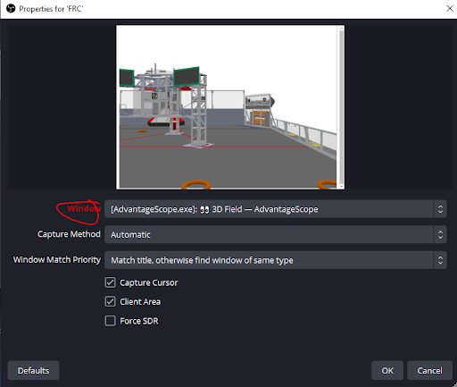

AvantageScope Simulation
========================

AvantageScope simulations allow the full simulation of a robot and all of its components on a virtual field. It can be further augmented with PhotonVIsion in order to simulate vision.

Before continuing, ensure WindowsPhotonVision is installed on your target device. For this, the target device will be your host. Instructions can be found :ref:`here <docs/installation/index:Installation & Setup>` for all devices.

Due to a lack of a physical robot, PhotonVision will be used to run the network tables instead of the roborio. Instructions can be found :ref:`here<docs/simulation/index:Hardware In The Loop Simulation>`. It is not required to change the Team Number/NetworkTables Server Address.

In order to interface AScope with PhotonVision, some extra software needs to be downloaded

 - `link Java: <https://adoptium.net/temurin/releases/?version=11>'
 - `link AdvantageScope (now comes bundled with wpilib): <https://github.com/Mechanical-Advantage/AdvantageScope/releases/tag/v3.0.1>'
 - `link NDI Core Suit: <https://ndi.video/tools/ndi-core-suite/>'
 - `link OBS: <https://obsproject.com/download>'
 - `link OBS-NDI Interfacer: <https://github.com/obs-ndi/obs-ndi/releases/tag/4.13.0>'

AdvantageScope setup
====================

1. Open 3D Field
2. Setup a robot (Doesn’t matter if you use 2D or 3D pose, just make sure theres a camera)
3. Pop out the window (Button on the top right next to the eye)

OBS
===

1. Create a new window capture source

2. Select the popped out AScope window as the source window

3. Under tools select NDI Output

4. Check Main Output & Preview Output

NDI Tools
=========

1. Select the webcam

2. In the popup on the bottom right, select the gear, then your computer name, then OBS

PhotonVision
============
1. In the camera tab, select the NDI Webcam you used

Code Setup
==========
1. Wherever your robot is first initialized (RobotContainer.java, Robot.java, main.java), set it to link to PhotonVision instead of the robot
.. code-block::
    public RobotContainer() {
      if(Robot.isSimulation()) {
        NetworkTableInstance inst = NetworkTableInstance.getDefault();
        inst.stopServer();
        // Change the IP address in the below function to the IP address you use to connect to the PhotonVision UI.
        inst.setServer("127.0.0.1");
        inst.startClient4("Robot Simulation");
      }
    }

