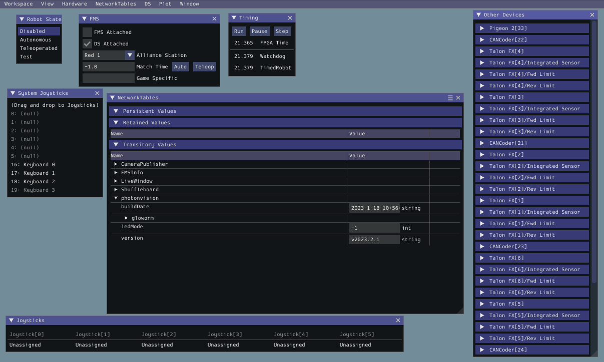

Hardware In The Loop Simulation
===============================

Hardware in the loop simulation is using a physical device, such as a supported co-processor running PhotonVision, to enhance simulation capabilities. This is useful for developing and validating code before the camera is attached to a robot, as well as reducing the work required to use WPILib simulation with PhotonVision.

The first step is to install PhotonVision on your target device. Instructions can be found :ref:`here <docs/installation/index:Installation & Setup>` for all devices.

A small amount of configuration is required after installation. From the PhotonVision UI, go to the sidebar and select the Settings option. Within the settings, turn on "Run NetworkTables Server".

.. warning:: Do not leave this toggle on when accessing your device on a full robot.

.. image:: images/nt-server-toggle.png

The final step is to configure your code to connect to the NetworkTables server run by your instance of PhotonVision. The code below shows how to disconnect your simulation from the default NetworkTables server and connect it to the PhotonVision hosted one.

.. note:: This will disable your robot code's internal NT server. Applications connecting to a NT server (e.g. Shuffleboard or Glass) must be connected to the PhotonVision NT server if this code has been run.

.. tab-set-code::

   .. code-block:: java

      if(RobotBase.isSimulation()) {
         NetworkTableInstance inst = NetworkTableInstance.getDefault();
         inst.stopServer();
         // Change the IP address in the below function to the IP address you use to connect to the PhotonVision UI.
         inst.setServer("photonvision.local");
         inst.startClient4("Robot Simulation");
      }

   .. code-block:: c++

      #include <frc/RobotBase.h>
      #include <networktables/NetworkTable.h>

      void Robot::RobotInit() {
        if constexpr (frc::RobotBase::IsSimulation()) {
          auto inst = nt::NetworkTableInstance::GetDefault();
          inst.StopServer();
          // Change the IP address in the below function to the IP address you use to
          // connect to the PhotonVision UI.
          inst.SetServer("localhost");
          inst.StartClient4("Robot Simulation");
        }
      }

Now launch simulation, and you should be able to see the PhotonVision table on your simulation's NetworkTables dashboard.

