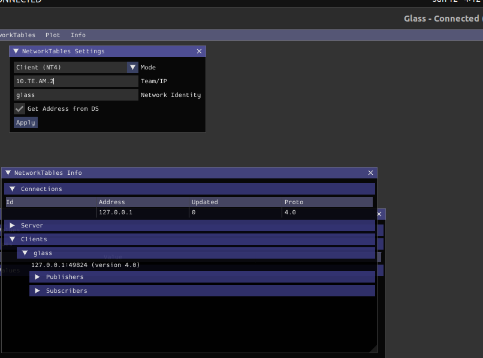
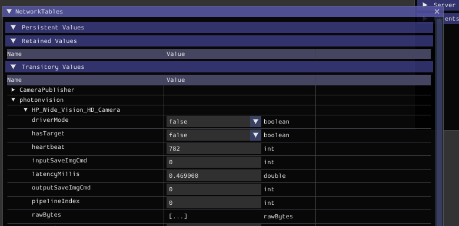

Common Issues / Questions
=========================

This page will grow as needed in order to cover commonly seen issues by teams. If this page doesn't help you and you need further assistance, feel free to :ref:`Contact Us<index:Contact Us>`.

Known Issues
------------
All known issues can be found on our `GitHub page <https://github.com/PhotonVision/photonvision/issues>`_.

PS3Eye
^^^^^^
Due to an issue with Linux kernels, the drivers for the PS3Eye are no longer supported. If you would still like to use the PS3Eye, you can downgrade your kernel with the following command: ``sudo CURL_CA_BUNDLE=/etc/ssl/certs/ca-certificates.crt rpi-update 866751bfd023e72bd96a8225cf567e03c334ecc4``. Note: You must be connected to the internet to run the command.

LED Control
^^^^^^^^^^^

The logic for controlling LED mode when `multiple cameras are connected` is not fully fleshed out. In its current state, LED control is only enabled when a Pi Camera Module is not in driver mode—meaning a USB camera on its own is unable to control the LEDs.

For now, if you are using multiple cameras, it is recommended that teams set the value of the NetworkTables entry :code:`photonvision/ledMode` from the robot code to control LED state.

Commonly Seen Issues
--------------------

Checklist
^^^^^^^^^

- Is your camera connected to the robot's radio through a :ref:`network switch? <docs/getting-started/installation/networking:Physical Networking>`?
   - Ethernet straight from a laptop to a coprocessor is unsupported due to the unreliability of link-local connections.
   - Even if there's a switch between your laptop and coprocessor, you'll still want a radio or router in the loop somehow.
   - The FRC radio is the *only* router we will officially support due to the innumerable variations between routers.
- (Raspberry Pi & Limelight only) have you flashed the correct image, and is it up to date?
   - Limelights and Gloworms should be flashed using the Limelight image (eg, `photonvision-v2023.1.2-linuxarm64-image_limelight.xz`).
   - Raspberry Pi devices (including Pi 3, Pi 4, CM3 and CM4) should be flashed using the Limelight image (eg, `photonvision-v2023.1.2-linuxarm64-image_RaspberryPi.xz`).
   - This is due to Limelight-specific hardware configuration that makes the image incompatible with stock Raspberry Pi devices.
- Is your robot code using a **2023** version of WPILib, and is your coprocessor using the most up to date **2023** release?
   - 2022 and 2023 versions of either cannot be mix-and-matched!
   - Your PhotonVision version can be checked on the :ref:`settings tab<docs/hardware/Settings:settings>`.
- Is your team number correctly set on the :ref:`settings tab<docs/hardware/Settings:settings>`?

Networking Issues
^^^^^^^^^^^^^^^^^
Ensure that you have followed :ref:`all the recommendations in the networking section <docs/getting-started/installation/networking:Physical Networking>`.

Camera won't show up
^^^^^^^^^^^^^^^^^^^^
Try these steps to :ref:`troubleshoot your camera connection <docs/troubleshooting/camera-troubleshooting:Camera Troubleshooting>`.

If you are using a USB camera, it is possible your USB Camera isn't supported by CSCore and therefore won't work with PhotonVision. See :ref:`supported hardware page for more information <docs/hardware/supportedhardware:Supported Cameras>`, or the above Camera Troubleshooting page for more information on determining this locally.

Camera is consistently returning incorrect values when in 3D mode
^^^^^^^^^^^^^^^^^^^^^^^^^^^^^^^^^^^^^^^^^^^^^^^^^^^^^^^^^^^^^^^^^
Read the tips on the :ref:`camera calibration page<docs/getting-started/pipeline-tuning/calibration:Calibration Tips>`, follow the advice there, and redo the calibration.

Not getting data from PhotonLib
^^^^^^^^^^^^^^^^^^^^^^^^^^^^^^^

1. Ensure your coprocessor version and PhotonLib version match. This can be checked by the settings tab and examining the .json itself (respectively).

2. Ensure that you have your team number set properly.

3. Use Glass to verify that PhotonVision has connected to the NetworkTables server served by your robot. With Glass connected in client mode to your RoboRIO, we expect to see "photonvision" listed under the Clients tab of the NetworkTables Info pane.

4. When creating a `PhotonCamera` in code, does the `cameraName` provided match the name in the upper-right card of the web interface? Glass can be used to verify the RoboRIO is receiving NetworkTables data by inspecting the `photonvision` subtable for your camera nickname.

Unable to download PhotonLib
^^^^^^^^^^^^^^^^^^^^^^^^^^^^
Ensure all of your network firewalls are disabled and you aren't on a school-network.

PhotonVision prompts for login on startup
^^^^^^^^^^^^^^^^^^^^^^^^^^^^^^^^^^^^^^^^^
This is normal. You don't need to connect a display to your Raspberry Pi to use PhotonVision, just navigate to the relevant webpage (ex. ``photonvision.local:5800``) in order to see the dashboard.

Raspberry Pi enters into boot looping state when using PhotonVision
^^^^^^^^^^^^^^^^^^^^^^^^^^^^^^^^^^^^^^^^^^^^^^^^^^^^^^^^^^^^^^^^^^^
This is most commonly seen when your Pi doesn't have adequate power / is being undervolted. Ensure that your power supply is functioning properly.

