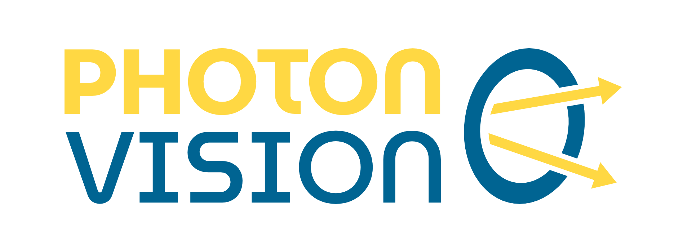

Welcome to the official documentation of PhotonVision! PhotonVision is the free, fast, and easy-to-use vision processing solution for the *FIRST*\  Robotics Competition. PhotonVision is designed to get vision working on your robot *quickly*, without the significant cost of other similar solutions. PhotonVision supports a variety of COTS hardware, including the Raspberry Pi 3 and 4, the `Gloworm smart camera <https://gloworm.vision>`_, and the `SnakeEyes Pi hat <https://www.playingwithfusion.com/productview.php?pdid=133>`_.

Content
-------

.. grid:: 2

    .. grid-item-card::  Getting Started
        :link: docs/getting-started/index
        :link-type: doc

        Get started with installing PhotonVision, creating a pipeline, and tuning it for usage in competitions.

    .. grid-item-card::  Programming Reference and PhotonLib
        :link: docs/programming/index
        :link-type: doc

        Learn more about PhotonLib, our vendor dependency which makes it easier for teams to retrieve vision data, make various calculations, and more.

.. grid:: 2

    .. grid-item-card::  Integration
        :link: docs/integration/index
        :link-type: doc

        Pick how to use vision processing results to control a physical robot.

    .. grid-item-card::  Code Examples
        :link: docs/examples/index
        :link-type: doc

        View various step by step guides on how to use data from PhotonVision in your code, along with a game-specific example.

.. grid:: 2

    .. grid-item-card::  Hardware
        :link: docs/hardware/index
        :link-type: doc

        Select appropriate hardware for high-quality, easy vision target detection.

    .. grid-item-card::  Contributing
        :link: docs/other/contributing/index
        :link-type: doc

        Interested in helping with PhotonVision? Learn more about how to contribute to our main code base, documentation, and more.

Source Code
-----------

The source code for all PhotonVision projects is available through our `GitHub organization <https://github.com/PhotonVision>`_.

* `PhotonVision <https://github.com/PhotonVision/photonvision>`_
* `PhotonVision ReadTheDocs <https://github.com/PhotonVision/photonvision-docs/>`_

Contact Us
----------

To report a bug or submit a feature request in PhotonVision, please `submit an issue on the PhotonVision GitHub <https://github.com/PhotonVision/photonvision>`_ or `contact the developers on Discord <https://discord.com/invite/KS76FrX>`_.

If you find a problem in this documentation, please submit an issue on the `PhotonVision Documentation GitHub <https://github.com/PhotonVision/photonvision-docs>`_.

License
-------

PhotonVision is licensed under the `GNU GPL v3 <https://www.gnu.org/licenses/gpl-3.0.en.html>`_.

Sitemap
-------

.. toctree::
   :maxdepth: 2

   docs/getting-started/about/index
   docs/getting-started/installation/index
   docs/getting-started/pipeline-tuning/index
   docs/hardware/index
   docs/programming/photonlib/index
   docs/programming/nt-api
   docs/integration/index
   docs/examples/index
   docs/getting-started/Networking
   docs/other/known-issues
   docs/other/troubleshooting-tips
   docs/other/contributing/index
